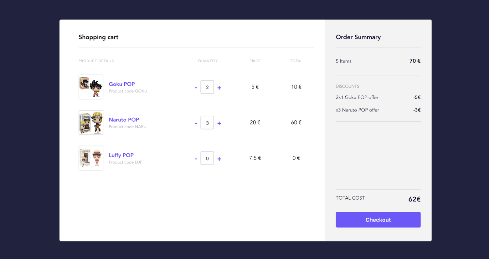
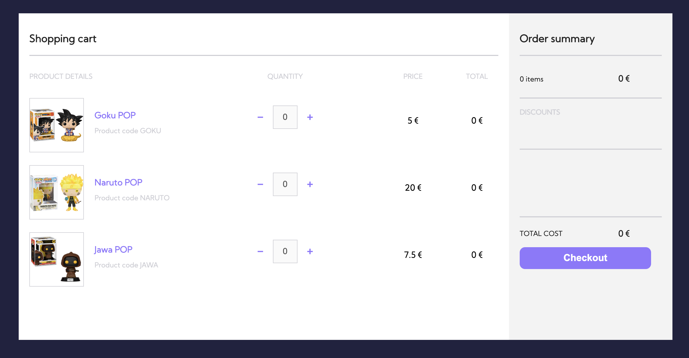
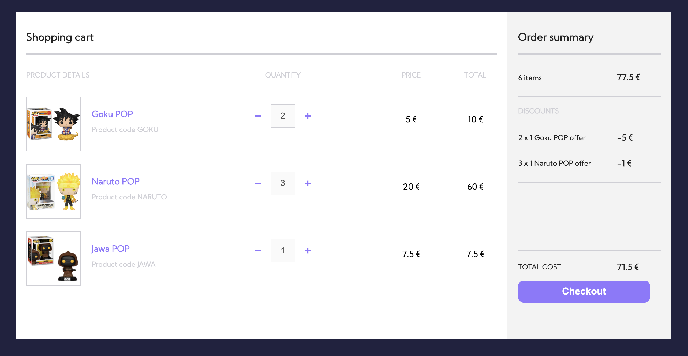

# Exercise


Ecommerce exercise done with ES6 and Webpack

Original mockup:


## Tech stack

This exercise is done with Vanilla JS (ES6) using Webpack as bundler builder and SASS as CSS precompiler (using Flex has CSS layout module).

## Implementation

There are three different products in the checkout page: Goku, Naruto and Jawa products from Funko POP.



The store applies some discounts for a couple of products:

- Goku POP product has a 2x1 offer.
- Naruto POP product has a discount of -1€ for each three products recursively.
- Jawa POP product has not any kind of discount.



## To execute it in a local environment

In a terminal window, run webpack-dev-server with hot reloading:

```sh
yarn start
```

## Commands

```sh
yarn build               # generates production bundler
yarn start               # starts local server with hot reloading

```

## Github repository


<a href="https://github.com/ibanjb/vanilla-ecommerce">Navigate to the Github page</a>
